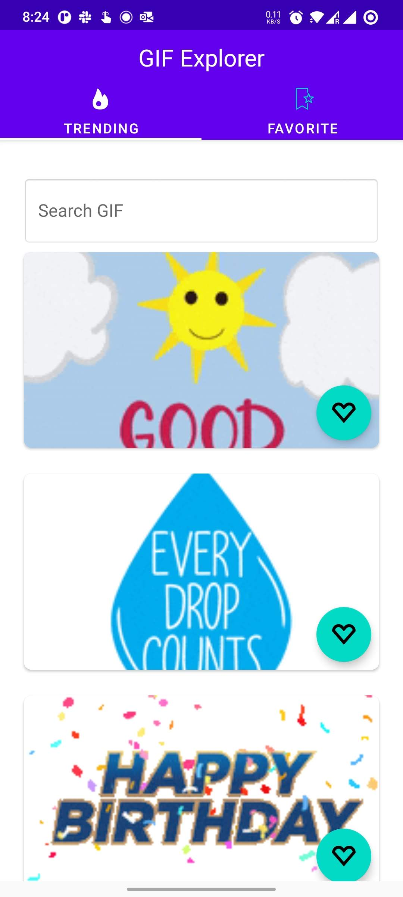

# GifExplorer
 Exploring GIF from Giphy API

### GIPHY API key

GifExplorer uses the [Giphy API](https://developers.giphy.com/docs/) to load GIF images.
To use the API, copy the API key and add it to the project in `gradle.properties` file as per below.

```
giphy_api_key=<your Giphy api key>
```
### Modern Android Development ([MAD Scoreboard](https://developer.android.com/modern-android-development/scorecard))


## Screenshots

 
  